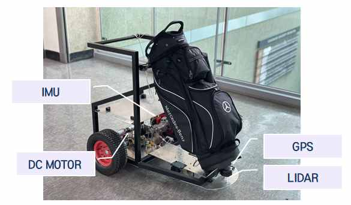

# **GPS based Caddy Robot project**
광운대학교 로봇학부 캡스톤 - 캐디 로봇 프로젝트  
Kwangwoon University Robotics Intelligence Caddy Robot Project

## **What Project?**
### 골프장에서 골퍼의 짐을 로봇에 실어 골퍼의 짐을 대신 들어주며 골퍼를 따라가는 로봇
---
## **Main feature**
### 골퍼를 따라가기 위해 필요한 경로 생성 알고리즘은 Potential Field를 사용하여 구현
###  추후 심층 강화학습을 사용한 경로 생성도 진행할 예정
---
## **개발 환경**
###
 * Ubuntu: 18.04
 * ROS: melodic 
###
---
## **Dependency Install**
###
 * sudo apt install ros-melodic-gps-common
 * sudo apt install ros-melodic-nav-msgs
 ###
 ---
 ## **Build**
 ###
  1. Build caddy_msg first
  2. Next, build a caddy Pkg.
###
---
## **Hardware**

## 